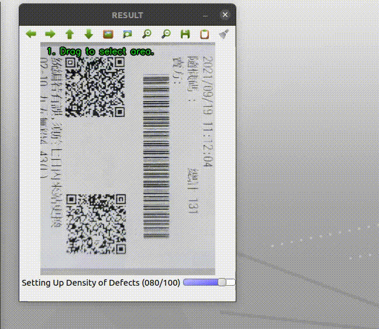

# gen-printing-defects
This program can generate printing defects with white background

## Features
1. Apply more transform's options with random value. 
2. User can select target area to generate defects. (step 1)
3. User can select printing defects color. (step 2)
4. Press 's' to save , 'q' to leave, other key to continue.

## DEMO



## How to use
1. Base Mode
```bash
$ python3 generate_dust.py -i ok.jpg
```
2. Select Mode
```bash
$ python3 generate_dust.py -s -i ok.jpg
```
3. DEMO Mode, Just generate quickly.
```bash
$ python3 generate_dust.py -a -i ok.jpg
```
4. DEMO with Select Mode
```bash
$ python3 generate_dust.py -a -s -i ok.jpg
```
5. Use `--Help` to get more details.
```bash

$ python3 generate_dust.py --help
usage: generate_dust.py [-h] [-s] [-a] [-i IMAGE] [-d DENSITY] [-o OUTPUT_DIR]

optional arguments:
  -h, --help            show this help message and exit
  -s, --select          select the target area.
  -a, --auto            auto gen mode ( for demo ).
  -i IMAGE, --image IMAGE
                        input images which you want to generate dust.
  -d DENSITY, --density DENSITY
                        fix dust's density. value:0~1
  -o OUTPUT_DIR, --output-dir OUTPUT_DIR
                        output directory.
```